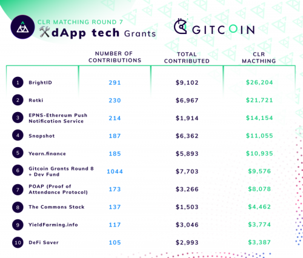
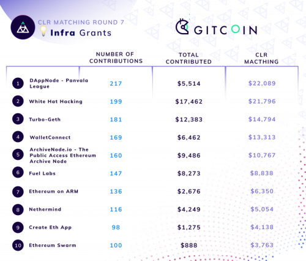
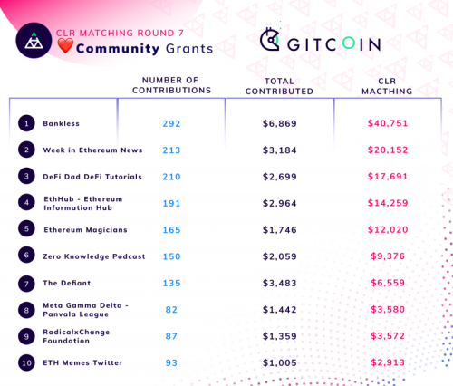
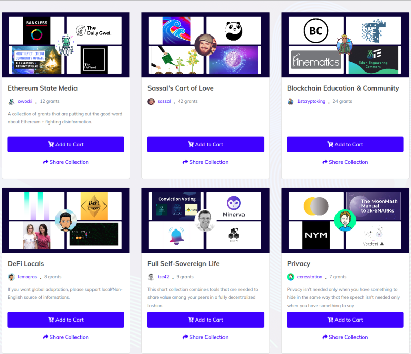
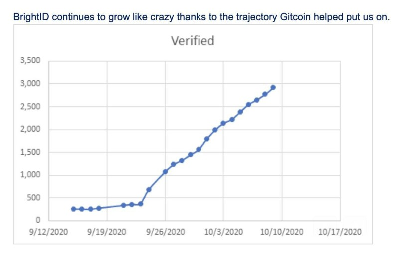
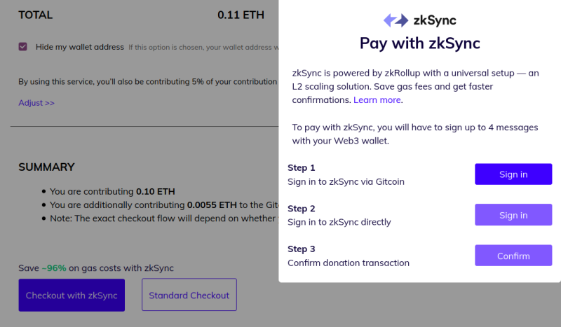

Gitcoin Grants第七轮已经圆满结束了！在本轮中，大家的兴趣空前高涨，捐赠数额也有所增长：857个项目获得27.483万美元捐赠以及45万美元匹配资金。

本轮捐赠类别再次发生了改变，分为“dapp技术”、“基础设施技术”以及“社区”。以下是本轮Grant的最终结果：

## DeFi贡献了匹配资金！

在这一轮中，我们的匹配金额比以往高出许多。这是因为除了以太坊基金会和其他一些参与者提供的常规匹配资金之外，首次获得了各个defi项目的高度参与：

匹配资金提供者有：

* [Chainlink](https://chain.link/)，智能合约预言机项目
* Optimism，layer2 optimistic rollup方案
* 以太坊基金会
* Balancer，去中心化交易所
* [Synthetix](https://synthetix.io/)，合成资产平台
* [Yearn](https://yearn.finance/)，抵押贷款平台
* [Three Arrows Capital](https://www.threearrowscap.com/about-us/)，投资基金
* [Defiance Capital](https://twitter.com/defiancecapital)，投资基金
* [Future Fund](https://twitter.com/future_fund_)，这绝对不是一家投资基金
* $MEME，meme币
* [Yam](https://yam.finance/)，defi项目
* 一些个人捐献者：ferretpatrol, [bantg](https://twitter.com/bantg/), [Mariano Conti](https://twitter.com/nanexcool/), [Robert Leshner](https://twitter.com/rleshner/), [Eric Conner](https://vitalik.ca/general/2020/10/18/twitter.com/econoar/), [10b576da0](https://twitter.com/10b57e6da0)

这些项目提供了大量的匹配资金，其中一些已在本轮中使用，也有一些资金预留作为“应急基金”，以防在未来轮次中匹配金额变少。

这对于生态来说是一个非常重要的里程碑，因为这表现了Gitcoin Grants对于少数资助者的依赖性降低，正在朝着一种更加可持续的方向发展。但值得思考的是，这些资助者的驱动力是什么？这是否是可持续的？

有几种潜在动机可能会在不同程度上发挥作用：

1. 从某种程度上来说，人天然是无私的，由于利息和代币价格的迅速上涨，在本轮中恰逢defi项目盆满钵满，因此将其中的一部分捐献出来似乎是“正确的选择”
2. 社区中的许多成员都对defi呈批判态度，将其视作无益的赌场，对以太坊的远大目标造成了负面影响。而参与公益是defi项目的一种表态，他们希望成为生态的贡献者，助其发展
3. 如果抛开这种负面看法，defi是一个竞争激烈的市场，其发展在很大程度上取决于社区的支持和网络效应，因此在生态系统中结善对于项目来说是非常有价值的
4. 发展最好的defi项目从这类公共产品中捕获到了足够的收益，因此进行贡献也符合他们自己的利益
5. 在defi项目中，存在高度的“共同所有”现象，即某种代币的持有者也持有其他代币和ETH。因此，即使进行大量资助不完全符合项目的利益，但是可能符合其代币持有者的利益，他们可能也持有被资助项目的代币，因此会推动项目进行资助。

当然了，我们还需要思考的问题就是：这些激励的可持续性程度如何？这种利他性和公共关系激励措施是否仅能发生一次性该种规模的爆发，还是可以更具可持续性？自此之后，二次方融资匹配的规模是否有希望达到200-300万美元？如果答案是肯定的，那么对于以太坊生态系统中公共产品融资 (public goods funding) 的多样化和民主化而言，这将是一个好消息。

### 媒体类受助方质量普遍上升

上一轮和本轮都呈现了一个奇怪的现象，在前几轮中具有“争议”的社区类受助方的地位开始自行下降了。理论上来说，似乎这类受助方应该持续得到拥护者的支持，而批评者对此仍然无能为力。而是事实本轮中最大的媒体类赢家相对无争议，并且是以太坊生态系统中广受欢迎的主流成员。零知识播客 ([Zero Knowledge Podcast](https://www.zeroknowledge.fm/)) 作为一个出色的播客，即便其面向的是相对小众且稍具技术背景的受众，也在本轮中获得了大量资助。

发生了什么呢？为什么媒体类受助方的质量自然而然地就提高了？或许是二次方融资机制的自我纠错能力比我们想象中要强？

### 超额偿付

在本轮中，每个类别的大赢家首次通通获得了巨额资助。基础设施类别的White Hat Hacking项目获得了39,258美元，社区类别的[Bankless](http://podcast.banklesshq.com/)播客则获得了47,620美元。我们可以思考这样一个问题：这些受助方获得的资助是否过度？

明确地说，我确实认为试图建立某种道德规范是非常不恰当的，规定公共产品贡献者只能赚取一定水平的报酬，而不能远超出这个范畴。相较之下，发布代币的人总是赚得盆满钵满，这种可能性对于公共产品贡献者来说是完全自然且公平的 (此外，这一轮的数额折算下来约每年20万美元，甚至还没那么高)。

然而，我们可以提出一个更为务实的问题：鉴于目前的奖励结构，同样是多捐献一美元，捐献给受助最多的项目或是捐献给受助不足却非常有价值的项目，是否后者更有意义？像是Turbogeth、Nethermind和RadicalXChange这类项目仍然可以利用微薄的资金做很多事情。由于本轮匹配资金首次达到这么大的规模，我们不得不重视这个问题。

尤其是如果将来匹配资金的规模越来越大，生态系统是否能够正确地分配资金并且避免某些项目的超额偿付？或者说，如果不能避免资金过度集中，那结果是否真的就那么糟糕？或许成为一轮grant的关注中心并获得50万美元意外之财的可能性能够激励公共产品贡献者的参与！

这些我们尚未得知的答案随着试验规模的不断扩大，或许将被首次揭开。

### 资助类别

目前Gitcoin Grants中的类别概念有些奇怪。每个类别都设有固定的匹配资金总量，在该类别中的项目之间进行分配。该机制从根本上来表达的是，我们可以信任社区能在一个类别内的项目之间进行选择，但是首先我们需要独立的技术判断来甄别资金应该如何在不同类别之间分配。

但是自此事情的走向更加吊诡。第七轮半途引入了“[collection”功能](https://gitcoin.co/grants/collections)：

如果我们在一个系列中点击“加入购物车”，就会将该系列中的所有项目都加入到购物车中。这个功能很奇怪，因为者似乎传递出了完全相反的信息：不清楚个中细节的用户可以选择将资金分配到整个类别，但是用户不能在每个类别中做出更主动的决策，除非手动编辑数量。

那么到底是怎样？我们信赖激进的二次方民主在每个类别中进行分配，却忽视了类别之间的分配？我们信赖其在每个类别之间进行分配，却不让人们在其中做出更细致的决策？我建议在第八轮中，应该对这些哲学挑战进行更加深入的思考，并且制定一种更具原则性的方式。

一种方案是只设立一个资金匹配池，然后所有的类别都作为自动的UI层。另一种方案则是以一种“扶持行动”(affirmative action) 的方式来启动特定类别。例如，我们可以将社区类别按地域划分，每个地域设立25,000美元的匹配资金池，如北美洲+大洋洲、拉丁美洲、欧洲、非洲、中东、印度、中亚+东南亚，从而使得更多被忽视的地区项目从中受益。还有许多可能性！还有一种混合路线，“主要”资金池可以在上一轮中自己二次融资！

### 身份验证

随着串谋、伪造账户和针对Gitcoin Grants的其他攻击日益增多，第七轮增加了一个额外的验证选项，使用了基于去中心化社交图谱的[BrightID](https://www.brightid.org/)，并将该项目的用户量提高了十倍：

这其实很好，除了帮助BrightID发展之外，还使该项目经受了一次试炼：现在有很大的动机尝试创建大量假帐户！BrightID将面临艰巨的挑战，虽然普通用户的门槛降低了，但同时又要防御来自虚假账户和重复帐户的攻击。我期待看到他们采取措施应对挑战！

### 用于扩容性的ZK rollups

最后，Gitcoin Grants本轮首次采用了[ZkSync](https://wallet.zksync.io/)这种ZK rollup技术，以降低支付费用：

主要成果简单来说就是ZK rollup确实成功地降低了费用！用户体验也不错。目前许多optimistic和ZK rollup项目都在寻求和[钱包集成](https://www.theblockcrypto.com/linked/80744/coinbase-wallet-optimisms-layer-2-rollup)，这能够进一步推动L2扩容技术的可用性和安全性。

### 结语

第七轮对Gitcoin Grants来说至关重要。匹配资金更加具备可持续性。现在的资金规模足够大，足以为二次方自由工作者提供足够的资金，以至于产生某个项目是否获得“太多资金”的担忧！身份验证也正在向前迈进。随着[ZkSync](https://wallet.zksync.io/) ZK rollup功能的加入，支付也更加高效。我期待看到Gitcoin Grants的长足发展。